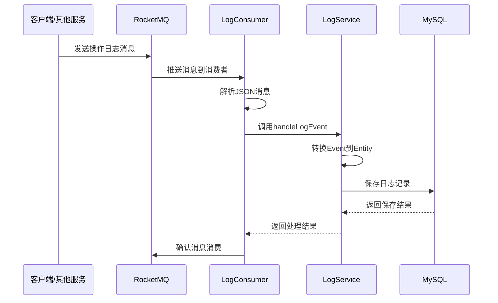
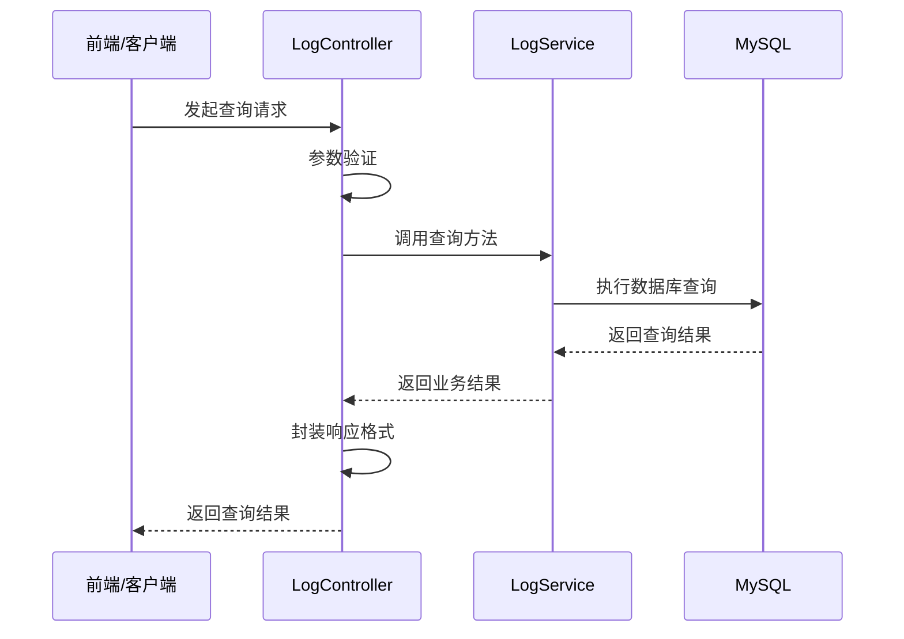

# Logging Service 功能文档

## 项目简介

Logging Service（日志服务）是一个基于Spring Boot的微服务，专门用于收集、存储和查询系统操作日志。该服务通过消息队列异步接收来自其他服务的日志消息，并提供丰富的查询API供前端和其他服务使用。

## 核心功能

### 1. 日志收集功能

#### 异步消息消费
- **消息队列**: RocketMQ
- **Topic**: `operation-log-topic`
- **消费组**: `logging-service-group`
- **消费模式**: 集群消费
- **消息格式**: JSON

#### 支持的日志类型
- 用户操作日志
- 系统事件日志
- 业务流程日志
- 错误异常日志

### 2. 日志存储功能

#### 数据持久化
- **数据库**: MySQL 8.0+
- **ORM框架**: Spring Data JPA
- **存储策略**: 结构化存储
- **索引优化**: 用户ID、时间戳、操作类型

#### 数据模型
```sql
CREATE TABLE operation_log (
    log_id BIGINT AUTO_INCREMENT PRIMARY KEY,
    user_id BIGINT NOT NULL,
    action VARCHAR(100) NOT NULL,
    ip VARCHAR(50),
    detail TEXT,
    timestamp DATETIME DEFAULT CURRENT_TIMESTAMP,
    INDEX idx_user_id (user_id),
    INDEX idx_timestamp (timestamp),
    INDEX idx_action (action)
);
```

### 3. 日志查询功能

#### 查询维度
- **用户维度**: 根据用户ID查询该用户的所有操作记录
- **时间维度**: 根据时间范围查询特定时间段的日志
- **操作维度**: 根据操作类型筛选相关日志
- **IP维度**: 根据IP地址查询来源日志

#### 查询特性
- **分页查询**: 支持大数据量的分页处理
- **排序功能**: 默认按时间倒序，支持自定义排序
- **组合查询**: 支持多条件组合查询
- **性能优化**: 合理使用索引提升查询效率

### 4. 服务治理功能

#### 服务注册与发现
- **注册中心**: Nacos
- **服务名称**: logging-service
- **健康检查**: 支持HTTP健康检查端点
- **负载均衡**: 支持多实例部署

#### 监控与运维
- **应用监控**: Spring Boot Actuator
- **JVM监控**: 内存、GC、线程等指标
- **业务监控**: 日志处理量、响应时间等
- **告警机制**: 支持异常情况告警

## 技术架构

### 系统架构图

```
┌─────────────────┐    ┌─────────────────┐    ┌─────────────────┐
│   用户服务       │    │   权限服务       │    │   其他服务       │
│  User Service   │    │Permission Service│    │  Other Services │
└─────────┬───────┘    └─────────┬───────┘    └─────────┬───────┘
          │                      │                      │
          └──────────────────────┼──────────────────────┘
                                 │
                                 ▼
                    ┌─────────────────────┐
                    │     RocketMQ        │
                    │   Message Queue     │
                    └─────────┬───────────┘
                              │
                              ▼
                    ┌─────────────────────┐
                    │   Logging Service   │
                    │                     │
                    │ ┌─────────────────┐ │
                    │ │   Consumer      │ │
                    │ └─────────────────┘ │
                    │ ┌─────────────────┐ │
                    │ │   Service       │ │
                    │ └─────────────────┘ │
                    │ ┌─────────────────┐ │
                    │ │   Controller    │ │
                    │ └─────────────────┘ │
                    └─────────┬───────────┘
                              │
                              ▼
                    ┌─────────────────────┐
                    │       MySQL         │
                    │     Database        │
                    └─────────────────────┘
```

### 核心组件

#### 1. 消息消费组件
- **OperationLogConsumer**: 消费RocketMQ消息
- **消费策略**: 并发消费，支持重试机制
- **异常处理**: 消费失败自动重试，超过阈值进入死信队列

#### 2. 业务服务组件
- **OperationLogService**: 核心业务逻辑
- **数据转换**: Event到Entity的转换
- **事务管理**: 确保数据一致性

#### 3. 数据访问组件
- **OperationLogRepository**: 数据访问层
- **自定义查询**: 基于Spring Data JPA的自定义查询方法
- **性能优化**: 查询优化和索引使用

#### 4. Web控制组件
- **LogController**: RESTful API控制器
- **参数验证**: 输入参数校验
- **响应封装**: 统一响应格式

## 业务流程

### 日志记录流程



### 日志查询流程



## API接口详情

### 1. 根据用户查询日志

**接口**: `GET /api/logs/user/{userId}`

**功能**: 查询指定用户的所有操作日志

**参数**:
- `userId`: 用户ID（路径参数）

**响应示例**:
```json
{
  "success": true,
  "data": [
    {
      "logId": 1,
      "userId": 123,
      "action": "登录系统",
      "ip": "192.168.1.100",
      "detail": "用户通过Web界面登录系统",
      "timestamp": "2024-06-21T09:30:00"
    }
  ],
  "message": "查询成功"
}
```

### 2. 分页查询日志

**接口**: `GET /api/logs`

**功能**: 分页查询操作日志，支持多种筛选条件

**参数**:
- `page`: 页码（默认0）
- `size`: 页大小（默认20）
- `userId`: 用户ID（可选）
- `action`: 操作类型（可选）
- `startTime`: 开始时间（可选）
- `endTime`: 结束时间（可选）

**响应示例**:
```json
{
  "success": true,
  "data": {
    "content": [...],
    "pageable": {...},
    "totalElements": 100,
    "totalPages": 5,
    "size": 20,
    "number": 0
  },
  "message": "查询成功"
}
```

### 3. 时间范围查询

**接口**: `GET /api/logs/range`

**功能**: 查询指定时间范围内的日志

**参数**:
- `startTime`: 开始时间（必填）
- `endTime`: 结束时间（必填）

## 消息格式规范

### 操作日志消息

**Topic**: `operation-log-topic`

**消息结构**:
```json
{
  "userId": 123,
  "action": "创建用户",
  "ip": "192.168.1.100", 
  "detail": "管理员创建了新用户：张三"
}
```

**字段说明**:
- `userId`: 执行操作的用户ID，必填
- `action`: 操作类型描述，必填
- `ip`: 操作来源IP地址，可选
- `detail`: 操作详细描述，可选

### 消息发送示例

#### Java代码示例
```java
@Autowired
private RocketMQTemplate rocketMQTemplate;

public void sendOperationLog(Long userId, String action, String ip, String detail) {
    OperationLogEvent event = new OperationLogEvent();
    event.setUserId(userId);
    event.setAction(action);
    event.setIp(ip);
    event.setDetail(detail);
    
    rocketMQTemplate.convertAndSend("operation-log-topic", event);
}
```

#### Spring Boot配置
```yaml
rocketmq:
  name-server: localhost:9876
  producer:
    group: your-service-producer
    send-message-timeout: 30000
```

## 配置管理

### 环境配置

#### 开发环境 (application-dev.yml)
```yaml
spring:
  datasource:
    url: jdbc:mysql://localhost:3306/logging_service_dev
    username: dev_user
    password: dev_password
  
  jpa:
    show-sql: true
    hibernate:
      ddl-auto: update

rocketmq:
  name-server: localhost:9876

logging:
  level:
    com.logging: DEBUG
```

#### 测试环境 (application-test.yml)
```yaml
spring:
  datasource:
    url: jdbc:h2:mem:testdb
    driver-class-name: org.h2.Driver
  
  jpa:
    hibernate:
      ddl-auto: create-drop
    show-sql: true

rocketmq:
  name-server: test-rocketmq:9876
```

#### 生产环境 (application-prod.yml)
```yaml
spring:
  datasource:
    url: jdbc:mysql://prod-mysql:3306/logging_service
    username: ${DB_USERNAME}
    password: ${DB_PASSWORD}
    hikari:
      maximum-pool-size: 20
      minimum-idle: 5
  
  jpa:
    show-sql: false
    hibernate:
      ddl-auto: validate

rocketmq:
  name-server: ${ROCKETMQ_NAMESERVER}
  
logging:
  level:
    com.logging: INFO
  file:
    name: /var/log/logging-service/app.log
```

## 性能优化

### 数据库优化

#### 索引策略
```sql
-- 用户ID索引（高频查询）
CREATE INDEX idx_user_id ON operation_log(user_id);

-- 时间戳索引（范围查询）
CREATE INDEX idx_timestamp ON operation_log(timestamp);

-- 操作类型索引（分类查询）
CREATE INDEX idx_action ON operation_log(action);

-- 复合索引（组合查询）
CREATE INDEX idx_user_timestamp ON operation_log(user_id, timestamp);
```

#### 分表策略
```sql
-- 按月分表示例
CREATE TABLE operation_log_202406 LIKE operation_log;
CREATE TABLE operation_log_202407 LIKE operation_log;

-- 分区表（MySQL 8.0+）
CREATE TABLE operation_log (
    -- 字段定义...
) PARTITION BY RANGE (YEAR(timestamp) * 100 + MONTH(timestamp)) (
    PARTITION p202406 VALUES LESS THAN (202407),
    PARTITION p202407 VALUES LESS THAN (202408),
    -- ...
);
```

### 应用优化

#### 连接池配置
```yaml
spring:
  datasource:
    hikari:
      maximum-pool-size: 20      # 最大连接数
      minimum-idle: 5            # 最小空闲连接
      connection-timeout: 30000  # 连接超时
      idle-timeout: 600000       # 空闲超时
      max-lifetime: 1800000      # 连接最大生命周期
```

#### JVM优化
```bash
-Xms2g -Xmx4g
-XX:+UseG1GC
-XX:MaxGCPauseMillis=200
-XX:+UseStringDeduplication
-XX:+PrintGCDetails
-XX:+PrintGCTimeStamps
```

### 消息队列优化

#### 消费者配置
```yaml
rocketmq:
  consumer:
    group: logging-service-group
    consume-thread-min: 5        # 最小消费线程
    consume-thread-max: 20       # 最大消费线程
    consume-message-batch-max-size: 1  # 批量消费大小
    pull-batch-size: 32          # 拉取批次大小
```

## 监控告警

### 监控指标

#### 应用指标
- **QPS**: 每秒查询数
- **响应时间**: 平均响应时间、P95、P99
- **错误率**: 4xx、5xx错误比例
- **JVM指标**: 内存使用、GC频率

#### 业务指标
- **日志处理量**: 每分钟处理的日志条数
- **消息堆积**: MQ中未消费的消息数量
- **数据库连接**: 连接池使用情况
- **存储容量**: 数据库存储使用情况

### 告警配置

#### Prometheus + Grafana
```yaml
# prometheus.yml
scrape_configs:
  - job_name: 'logging-service'
    static_configs:
      - targets: ['logging-service:8083']
    metrics_path: '/actuator/prometheus'
    scrape_interval: 15s
```

#### 告警规则
```yaml
groups:
  - name: logging-service
    rules:
      - alert: HighErrorRate
        expr: rate(http_server_requests_seconds_count{status=~"5.."}[5m]) > 0.1
        for: 2m
        labels:
          severity: critical
        annotations:
          summary: "日志服务错误率过高"
          
      - alert: HighResponseTime
        expr: http_server_requests_seconds{quantile="0.95"} > 1
        for: 5m
        labels:
          severity: warning
        annotations:
          summary: "日志服务响应时间过长"
```

## 故障处理

### 常见问题及解决方案

#### 1. 消息堆积
**现象**: RocketMQ中消息堆积，消费延迟

**排查步骤**:
1. 检查消费者线程数配置
2. 查看数据库连接池状态
3. 分析SQL执行时间
4. 检查JVM内存使用

**解决方案**:
- 增加消费者线程数
- 优化数据库查询
- 增加应用实例
- 调整JVM参数

#### 2. 数据库连接超时
**现象**: 频繁出现数据库连接超时异常

**排查步骤**:
1. 检查数据库服务状态
2. 查看连接池配置
3. 分析慢查询日志
4. 检查网络连接

**解决方案**:
- 调整连接池参数
- 优化SQL查询
- 增加数据库资源
- 检查网络配置

#### 3. 内存溢出
**现象**: 应用出现OutOfMemoryError

**排查步骤**:
1. 分析堆转储文件
2. 检查JVM内存配置
3. 查看对象生命周期
4. 分析GC日志

**解决方案**:
- 增加堆内存大小
- 优化对象使用
- 调整GC策略
- 修复内存泄露

## 版本升级

### 升级策略

#### 1. 蓝绿部署
```bash
# 部署新版本到绿环境
kubectl apply -f deployment-green.yaml

# 验证新版本功能
curl http://logging-service-green/actuator/health

# 切换流量到绿环境
kubectl patch service logging-service -p '{"spec":{"selector":{"version":"green"}}}'

# 验证无误后删除蓝环境
kubectl delete deployment logging-service-blue
```

#### 2. 滚动更新
```bash
# 更新镜像版本
kubectl set image deployment/logging-service app=logging-service:v1.1.0

# 监控更新过程
kubectl rollout status deployment/logging-service

# 如有问题，回滚到上一版本
kubectl rollout undo deployment/logging-service
```

### 数据库迁移

#### 版本兼容性
- **向前兼容**: 新版本能处理旧格式数据
- **向后兼容**: 旧版本能处理新格式数据（有限支持）
- **迁移脚本**: 提供数据格式升级脚本

#### 迁移步骤
```sql
-- 1. 备份数据
CREATE TABLE operation_log_backup AS SELECT * FROM operation_log;

-- 2. 执行迁移脚本
ALTER TABLE operation_log ADD COLUMN new_field VARCHAR(255);
UPDATE operation_log SET new_field = 'default_value';

-- 3. 验证数据完整性
SELECT COUNT(*) FROM operation_log;
SELECT COUNT(*) FROM operation_log_backup;
```

## 最佳实践

### 开发规范

#### 代码规范
- 遵循阿里巴巴Java开发手册
- 使用统一的代码格式化配置
- 编写清晰的注释和文档
- 遵循RESTful API设计原则

#### 测试规范
- 单元测试覆盖率不低于80%
- 集成测试覆盖主要业务流程
- 性能测试验证关键指标
- 定期执行回归测试

#### 安全规范
- 输入参数严格验证
- SQL注入防护
- 敏感信息脱敏
- 访问权限控制

### 运维规范

#### 部署规范
- 使用容器化部署
- 实施蓝绿部署或滚动更新
- 配置健康检查
- 设置资源限制

#### 监控规范
- 全面的监控指标覆盖
- 及时的告警机制
- 详细的日志记录
- 定期的性能评估

#### 备份规范
- 定期数据备份
- 备份恢复演练
- 异地备份策略
- 备份有效性验证
