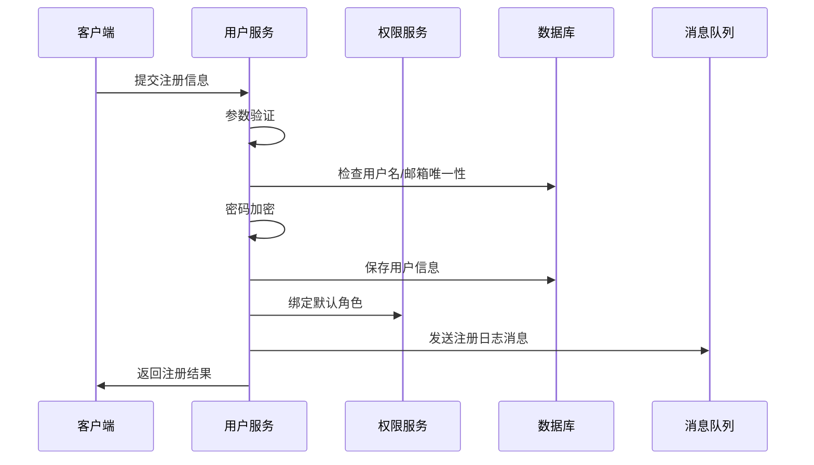
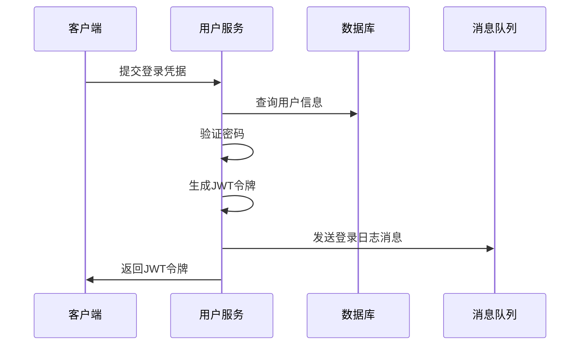
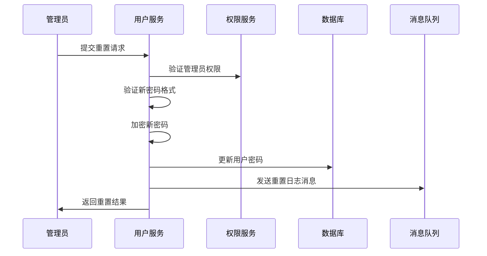

# User Service 功能文档

## 功能概述

User Service 是用户管理微服务，负责处理用户相关的核心业务功能，包括用户注册、身份认证、信息管理、权限控制等。本服务采用微服务架构设计，支持高并发、高可用的用户管理需求。

## 核心功能模块

### 1. 用户注册模块

#### 功能描述
提供新用户注册功能，支持用户名、邮箱、手机号等多种注册方式，确保用户信息的唯一性和安全性。

#### 主要特性
- ✅ 用户名唯一性验证
- ✅ 邮箱格式验证和唯一性检查
- ✅ 手机号格式验证（可选）
- ✅ 密码强度验证
- ✅ 密码加密存储（BCrypt）
- ✅ 自动分配默认角色
- ✅ 分布式事务支持
- ✅ 注册日志记录

#### 业务流程


#### 验证规则
| 字段 | 规则 | 说明 |
|------|------|------|
| username | 3-20字符，字母数字下划线 | 用户名必须唯一 |
| password | 6-50字符 | 建议包含字母、数字、特殊字符 |
| email | 标准邮箱格式 | 邮箱必须唯一 |
| phone | 11位手机号（可选） | 支持中国大陆手机号格式 |

#### 错误处理
- **用户名已存在**: 返回400错误，提示用户名重复
- **邮箱已存在**: 返回400错误，提示邮箱重复
- **密码格式错误**: 返回400错误，提示密码规则
- **权限服务调用失败**: 事务回滚，返回500错误

---

### 2. 用户登录模块

#### 功能描述
提供用户身份认证功能，验证用户凭据并生成JWT访问令牌，支持无状态的分布式认证。

#### 主要特性
- ✅ 用户名/密码认证
- ✅ 密码安全验证（防暴力破解）
- ✅ JWT令牌生成
- ✅ 令牌过期控制
- ✅ 登录日志记录
- ✅ 登录状态追踪

#### 业务流程


#### JWT令牌设计
```json
{
  "header": {
    "alg": "HS256",
    "typ": "JWT"
  },
  "payload": {
    "userId": 1001,
    "username": "testuser",
    "iat": 1624267200,
    "exp": 1624353600
  },
  "signature": "签名信息"
}
```

#### 安全机制
- **密码加密**: 使用BCrypt进行密码哈希
- **令牌过期**: 默认24小时过期
- **签名验证**: 使用HMAC SHA256算法
- **IP地址记录**: 记录登录IP用于安全审计

---

### 3. 用户信息管理模块

#### 功能描述
提供用户信息的查询、更新功能，支持基于角色的访问控制，确保数据安全。

#### 主要特性
- ✅ 用户信息查询
- ✅ 分页用户列表查询
- ✅ 用户信息更新
- ✅ 权限控制（用户只能操作自己的信息）
- ✅ 管理员特权（可操作所有用户）
- ✅ 操作日志记录

#### 权限控制矩阵
| 操作 | 普通用户 | 管理员 | 超级管理员 |
|------|----------|--------|------------|
| 查看自己信息 | ✅ | ✅ | ✅ |
| 查看他人信息 | ❌ | ✅ | ✅ |
| 修改自己信息 | ✅ | ✅ | ✅ |
| 修改他人信息 | ❌ | ✅ | ✅ |
| 查看用户列表 | 仅自己 | ✅ | ✅ |

#### 可更新字段
- **邮箱地址**: 需要验证格式和唯一性
- **手机号码**: 需要验证格式
- **个人资料**: 昵称、头像等扩展信息

#### 不可更新字段
- **用户名**: 创建后不可修改
- **密码**: 通过专门的重置接口修改
- **用户ID**: 系统自动生成
- **创建时间**: 系统自动设置

---

### 4. 密码管理模块

#### 功能描述
提供密码重置功能，支持管理员重置用户密码，确保密码安全性。

#### 主要特性
- ✅ 管理员密码重置
- ✅ 密码强度验证
- ✅ 密码加密存储
- ✅ 重置日志记录
- ✅ 权限验证

#### 业务流程


#### 重置策略
- **权限要求**: 仅管理员可执行
- **目标用户**: 不能重置超级管理员密码
- **密码规则**: 与注册时相同的密码强度要求
- **安全审计**: 记录重置操作的详细日志

---

### 5. 权限集成模块

#### 功能描述
通过Feign客户端与权限服务集成，实现基于角色的访问控制（RBAC）。

#### 主要特性
- ✅ 用户角色查询
- ✅ 权限验证
- ✅ 服务间通信
- ✅ 熔断降级
- ✅ 超时控制

#### 角色体系
```
超级管理员 (super_admin)
├── 管理员 (admin)
│   ├── 用户管理权限
│   ├── 密码重置权限
│   └── 数据查看权限
└── 普通用户 (user)
    ├── 个人信息管理
    └── 基础功能访问
```

#### 权限验证逻辑
```java
public boolean hasPermission(Long currentUserId, Long targetUserId) {
    // 用户可以操作自己
    if (currentUserId.equals(targetUserId)) {
        return true;
    }
    
    // 获取当前用户角色
    String currentRole = getUserRole(currentUserId);
    String targetRole = getUserRole(targetUserId);
    
    // 管理员可以操作普通用户
    if ("admin".equals(currentRole) && "user".equals(targetRole)) {
        return true;
    }
    
    // 超级管理员可以操作所有用户
    if ("super_admin".equals(currentRole)) {
        return true;
    }
    
    return false;
}
```

---

### 6. 日志记录模块

#### 功能描述
记录用户操作日志，支持操作审计和安全监控。

#### 主要特性
- ✅ 异步日志记录
- ✅ 操作轨迹追踪
- ✅ 安全事件监控
- ✅ 性能影响最小化

#### 日志类型
| 操作类型 | 记录内容 | 重要级别 |
|----------|----------|----------|
| 用户注册 | 用户ID、用户名、IP地址、时间 | INFO |
| 用户登录 | 用户ID、用户名、IP地址、时间 | INFO |
| 信息更新 | 用户ID、更新字段、IP地址、时间 | INFO |
| 密码重置 | 目标用户ID、操作员ID、IP地址、时间 | WARN |
| 权限异常 | 用户ID、操作类型、IP地址、时间 | ERROR |

#### 日志格式
```json
{
  "timestamp": "2024-06-21T10:30:00.000Z",
  "userId": 1001,
  "action": "USER_REGISTER",
  "detail": "用户注册成功",
  "ip": "192.168.1.100",
  "userAgent": "Mozilla/5.0...",
  "result": "SUCCESS"
}
```

---

### 7. 健康检查模块

#### 功能描述
提供服务健康状态检查，支持服务发现和负载均衡。

#### 主要特性
- ✅ 服务状态检查
- ✅ 依赖服务检查
- ✅ 数据库连接检查
- ✅ 内存使用监控

#### 检查项目
```yaml
健康检查项目:
  - 应用状态: UP/DOWN
  - 数据库连接: UP/DOWN
  - 权限服务连接: UP/DOWN
  - 消息队列连接: UP/DOWN
  - 内存使用率: < 80%
  - 磁盘空间: > 1GB
```

#### 健康报告示例
```json
{
  "status": "UP",
  "components": {
    "db": {
      "status": "UP",
      "details": {
        "database": "MySQL",
        "validationQuery": "isValid()"
      }
    },
    "diskSpace": {
      "status": "UP",
      "details": {
        "total": 10737418240,
        "free": 8589934592,
        "threshold": 1073741824
      }
    }
  }
}
```

## 技术实现

### 1. 数据模型设计

#### 用户实体 (User)
```java
@Entity
@Table(name = "users")
public class User {
    @Id
    @GeneratedValue(strategy = GenerationType.IDENTITY)
    private Long userId;
    
    @Column(unique = true, nullable = false, length = 50)
    private String username;
    
    @Column(nullable = false)
    private String password;
    
    @Column(unique = true, nullable = false, length = 100)
    private String email;
    
    @Column(length = 20)
    private String phone;
    
    @CreationTimestamp
    private LocalDateTime createdAt;
    
    @UpdateTimestamp
    private LocalDateTime updatedAt;
}
```

#### 数据传输对象设计
- **UserRegisterRequest**: 注册请求
- **UserLoginRequest**: 登录请求
- **UserUpdateRequest**: 更新请求
- **UserResponse**: 用户信息响应
- **ApiResponse<T>**: 统一响应格式

### 2. 服务层架构

#### 接口设计
```java
public interface UserService {
    ApiResponse<UserResponse> register(UserRegisterRequest request, String clientIp);
    ApiResponse<String> login(UserLoginRequest request, String clientIp);
    ApiResponse<UserResponse> getUserById(Long userId, Long currentUserId);
    ApiResponse<Page<UserResponse>> getUserList(Long currentUserId, Pageable pageable);
    ApiResponse<UserResponse> updateUser(Long userId, UserUpdateRequest request, Long currentUserId, String clientIp);
    ApiResponse<String> resetPassword(Long userId, String newPassword, Long currentUserId, String clientIp);
    String getUserRole(Long userId);
    boolean hasPermission(Long currentUserId, Long targetUserId);
}
```

#### 实现特点
- **事务管理**: 使用@Transactional确保数据一致性
- **异常处理**: 统一异常处理机制
- **参数验证**: 多层验证确保数据安全
- **性能优化**: 合理的查询策略和缓存机制

### 3. 控制器层设计

#### REST API设计
```java
@RestController
@RequestMapping("/user")
public class UserController {
    @PostMapping("/register")
    public ApiResponse<UserResponse> register(@RequestBody UserRegisterRequest request, HttpServletRequest httpRequest);
    
    @PostMapping("/login")
    public ApiResponse<String> login(@RequestBody UserLoginRequest request, HttpServletRequest httpRequest);
    
    @GetMapping("/{userId}")
    public ApiResponse<UserResponse> getUserInfo(@PathVariable Long userId, HttpServletRequest httpRequest);
    
    @GetMapping("/users")
    public ApiResponse<Page<UserResponse>> getUserList(@RequestParam(defaultValue = "0") int page, @RequestParam(defaultValue = "10") int size, HttpServletRequest httpRequest);
    
    @PutMapping("/{userId}")
    public ApiResponse<UserResponse> updateUser(@PathVariable Long userId, @RequestBody UserUpdateRequest request, HttpServletRequest httpRequest);
    
    @PostMapping("/reset-password")
    public ApiResponse<String> resetPassword(@RequestBody ResetPasswordRequest request, HttpServletRequest httpRequest);
    
    @GetMapping("/current-role")
    public ApiResponse<String> getCurrentUserRole(HttpServletRequest httpRequest);
    
    @GetMapping("/health")
    public ApiResponse<String> health();
}
```

### 4. 安全机制

#### JWT认证
```java
@Component
public class JwtUtil {
    public String generateToken(Long userId, String username);
    public boolean validateToken(String token);
    public Long getUserIdFromToken(String token);
    public String getUsernameFromToken(String token);
}
```

#### 密码加密
```java
@Component
public class PasswordUtil {
    public boolean isValidPassword(String password);
    public String encryptPassword(String password);
    public boolean verifyPassword(String rawPassword, String encodedPassword);
}
```

### 5. 集成服务

#### 权限服务客户端
```java
@FeignClient(name = "permission-service")
public interface PermissionServiceClient {
    @PostMapping("/rpc/user/{userId}/role/default")
    String bindDefaultRole(@PathVariable("userId") Long userId);
    
    @GetMapping("/rpc/user/{userId}/role")
    String getUserRoleCode(@PathVariable("userId") Long userId);
}
```

#### 消息发送工具
```java
@Component
public class MessageUtil {
    public void sendRegisterLog(Long userId, String username, String ip);
    public void sendLoginLog(Long userId, String username, String ip);
    public void sendUpdateLog(Long userId, String detail, String ip);
    public void sendPasswordResetLog(Long userId, String ip);
}
```

## 性能特性

### 1. 响应时间指标

| 接口 | 平均响应时间 | 95%响应时间 | 99%响应时间 |
|------|-------------|-------------|-------------|
| 用户注册 | 200ms | 500ms | 1000ms |
| 用户登录 | 150ms | 300ms | 600ms |
| 查询用户信息 | 50ms | 100ms | 200ms |
| 更新用户信息 | 100ms | 200ms | 400ms |

### 2. 并发处理能力

- **QPS**: 1000+ (在4核8GB配置下)
- **连接池**: 默认20个数据库连接
- **线程池**: Tomcat默认200个工作线程
- **内存使用**: 正常运行时约500MB

### 3. 优化策略

#### 数据库优化
- **索引设计**: username、email唯一索引
- **连接池**: HikariCP连接池优化
- **查询优化**: 避免N+1查询问题

#### 应用优化
- **异步处理**: 日志记录异步化
- **缓存策略**: 适当使用缓存减少数据库压力
- **连接复用**: HTTP客户端连接池

## 监控和运维

### 1. 关键指标监控

#### 业务指标
- 用户注册成功率
- 用户登录成功率
- 接口响应时间
- 错误率统计

#### 系统指标
- CPU使用率
- 内存使用率
- 数据库连接数
- JVM GC频率

### 2. 告警设置

```yaml
告警规则:
  - 用户注册失败率 > 5%
  - 用户登录失败率 > 10%
  - 接口响应时间 > 2秒
  - 内存使用率 > 80%
  - 数据库连接数 > 15
```

### 3. 日志监控

#### 关键日志
- 用户注册/登录日志
- 权限验证失败日志
- 系统异常日志
- 性能慢查询日志

#### 日志分析
- 用户活跃度分析
- 异常操作检测
- 性能瓶颈识别
- 安全威胁发现

## 扩展性设计

### 1. 水平扩展

- **无状态设计**: 服务无状态，支持多实例部署
- **数据库分离**: 读写分离、分库分表支持
- **缓存集群**: Redis集群支持
- **负载均衡**: Nginx/ALB负载均衡

### 2. 功能扩展

#### 认证方式扩展
- 手机号验证码登录
- 邮箱验证码登录
- 第三方登录（微信、QQ、钉钉）
- 生物识别登录

#### 安全功能扩展
- 登录行为分析
- 异常登录检测
- 密码策略强化
- 账户锁定机制

#### 用户信息扩展
- 用户画像
- 偏好设置
- 社交关系
- 活动轨迹

### 3. 集成扩展

#### 消息通知
- 短信通知
- 邮件通知
- 站内消息
- 推送通知

#### 数据分析
- 用户行为分析
- 业务指标统计
- 报表生成
- 数据导出

## 最佳实践

### 1. 开发规范

#### 代码规范
- 遵循阿里巴巴Java开发手册
- 使用统一的代码格式化配置
- 保持良好的代码注释
- 编写完整的单元测试

#### 接口设计
- RESTful API设计原则
- 统一的响应格式
- 合理的HTTP状态码使用
- 完整的接口文档

### 2. 安全实践

#### 数据安全
- 敏感数据加密存储
- 密码不可逆加密
- 数据传输HTTPS加密
- 接口访问权限控制

#### 操作安全
- 重要操作二次确认
- 操作日志完整记录
- 异常操作告警
- 定期安全审计

### 3. 运维实践

#### 部署策略
- 蓝绿部署减少服务中断
- 滚动更新保证服务连续性
- 自动化部署流程
- 完整的回滚机制

#### 监控策略
- 全链路监控
- 实时告警
- 性能基线建立
- 容量规划

## 版本规划

### v1.0.0 (当前版本)
- ✅ 基础用户管理功能
- ✅ JWT认证机制
- ✅ 权限集成
- ✅ 操作日志记录

### v1.1.0 (计划中)
- 🔄 手机验证码登录
- 🔄 用户头像上传
- 🔄 登录设备管理
- 🔄 密码复杂度策略

### v1.2.0 (规划中)
- 📋 第三方登录集成
- 📋 用户行为分析
- 📋 异常登录检测
- 📋 账户安全中心

### v2.0.0 (远期规划)
- 📋 微服务拆分优化
- 📋 事件驱动架构
- 📋 多租户支持
- 📋 全球化部署

## 总结

User Service 作为用户管理的核心服务，提供了完整的用户生命周期管理功能。通过合理的架构设计、完善的安全机制、全面的监控体系，确保了服务的高可用性、高性能和高安全性。

### 核心优势
1. **功能完整**: 覆盖用户管理的全生命周期
2. **架构合理**: 微服务设计，支持水平扩展
3. **安全可靠**: 多层安全防护，完整的审计日志
4. **性能优良**: 高并发处理能力，优秀的响应时间
5. **易于维护**: 完善的文档，标准的开发规范

### 应用场景
- 企业内部用户管理系统
- SaaS平台用户认证服务
- 电商平台用户中心
- 移动应用后端服务
- 微服务架构中的用户服务

通过不断的功能迭代和技术优化，User Service 将为各种应用场景提供稳定、高效的用户管理解决方案。

---

*最后更新时间: 2024-06-21*
